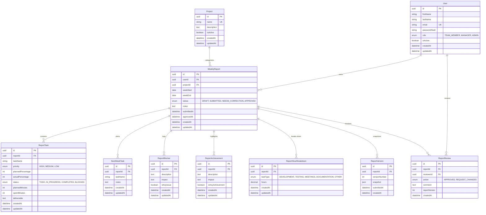

# Database Entity Relationship (ER) Diagram

This document illustrates the database schema and relational model for the **Weekly Report Generator & Team Dashboard**.

---

## Explanation of Relational Architecture

### 1. User & Project Associations
- **`User` $\to$ `WeeklyReport` (1:N)**: A user (team member) owns and authors multiple weekly reports over time. Each report uniquely references its author (`userId`).
- **`Project` $\to$ `WeeklyReport` (1:N)**: Each report is associated with one primary project. Projects cannot be deleted if active historical reports reference them (`ON DELETE RESTRICT`), preventing data corruption.
- **`User` $\to$ `ReportReview` (1:N)**: A user with `MANAGER` or `ADMIN` privileges can review reports and is recorded as the `reviewerId` on review audit events.

### 2. Report Child Collections
Each `WeeklyReport` acts as an aggregate root for weekly operational data:
- **`ReportTask`**: Detailed task entries with percentage completion, time planned vs. spent (minutes), priority, status, and deliverables.
- **`NextWeekTask`**: Forward-looking task commitments planned for the upcoming week.
- **`ReportBlocker`**: Key impediments and obstacles encountered (with an indicator for key critical issues).
- **`ReportAchievement`**: Highlights, milestones, or key wins completed during the week.
- **`ReportHourBreakdown`**: Categorical distribution of worked hours (Development, Testing, Meetings, Documentation, Other).

All child collections cascade on report deletion (`ON DELETE CASCADE`).

### 3. Versioning & Audit History Separation
- **`ReportVersion`**: Whenever a report is submitted (or resubmitted after corrections), an immutable JSON snapshot is saved in `ReportVersion` with an incremented `versionNumber`. This preserves the exact state of what was submitted at that point in time, independent of subsequent edits.
- **`ReportReview`**: Records the manager's review action (`APPROVED` or `REQUEST_CHANGES`), feedback comments, the specific `reportVersion` reviewed, timestamp, and reviewer ID.
- **Why Separate?**: Decoupling the mutable active working draft (`weekly_reports` and child tables) from immutable submission snapshots (`report_versions`) and review audit trails (`report_reviews`) ensures a full non-destructive revision history while maintaining fast operational queries.
